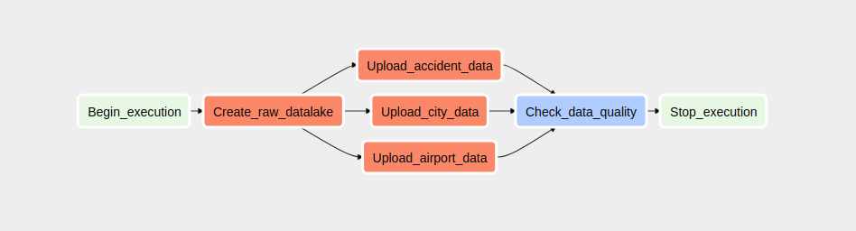
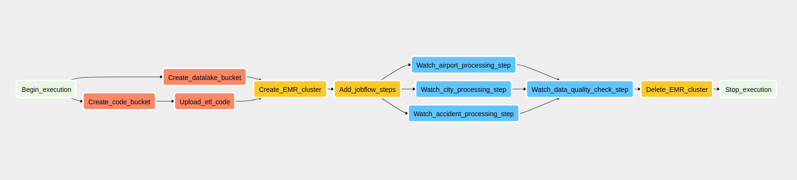
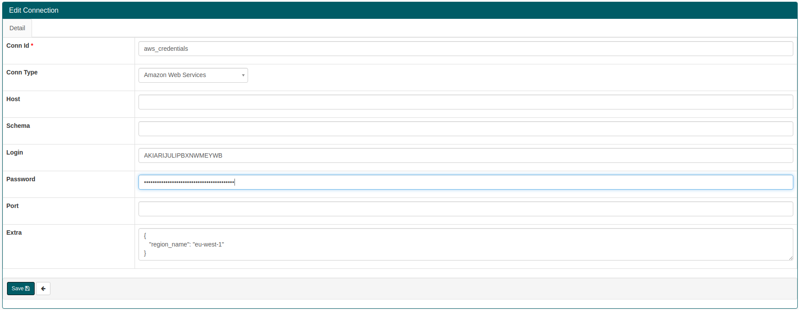

# us-accidents-data-enginering

## Introduction

This is a capstone project for the Udacity DataEngineering Nanodegree.
The purpose of the data engineering capstone project is to give you a chance to combine everything learned throughout the program. 

#### Datasets
We are going to work with 3 different datasets and try to combine them in a useful way to extract meaningful information.

Dataset Sources:
- [US Accidents](https://www.kaggle.com/sobhanmoosavi/us-accidents) (2.25 million records, 819 MB, CSV)
    - This is a countrywide traffic accident dataset, which covers 49 states of the United States. 
- [US Cities: Demographics](https://public.opendatasoft.com/explore/dataset/us-cities-demographics) (2892 records, 255 KB, CSV)
    - This dataset contains information about the demographics of all US cities and census-designated places with a population greater or equal to 65,000. 
- [Airport Codes](https://datahub.io/core/airport-codes#data) (17 MB, JSON)
    - This dataset contains the list of many airport codes in the wordls.
    
#### Goal
The idea is to create an optimized data lake which will enable users to analyze accidents data and determine root causes of accidents.
The main goal of this project is to build an end to end data pipeline which is capable to work with big volumes of data.
We want to clean, transform and load the data to our optimized data lake on S3.
The data lake will consist of logical tables partitioned by certain columns to optimize query latency.
    
#### Technologies
We are going to store our data lake on Amazon S3, which is is an object storage service that offers industry-leading scalability, data availability, security, and performance.
S3 is a perfect places for storing our data partitioned and grouped in files. It has low cost and a lot of flexibility.

For our ETL process we are using Apache Spark running on an EMR cluster on AWS. Sprak provides great performance because it 
stores the data in-memory shared across the cluster. 

Finally, to orchestrate everything, we are going to build a data pipeline using Apache Airflow. Airflow provides an intuitive
UI where we can track the progress and bottlenecks of our pipelines.
    
    
## Explore Data Quality
First we need to explore the data to identify data quality issues, like missing values, duplicate data, etc.

Regarding tha City Demographics dataset, the data is containing duplicate rows regarding the pair (city, state). In our
case we are more interested in the total population of the place so we are going to drop those duplicates.

The US Accidents dataset is of good quality, but it contains a lot of columns (50). In our case we are going to use only a
subset of these columns so we are going to extract them in the ETL process.
Despite only needing a subset of the columns for the optimized data lake, we are going to upload all columns into the raw data lake,
because in the future we may decide to enrich our data model and add more columns, so it is a good idea to store the raw data in S3.

The Airports dataset contains some missing values, but the columns that we are interested in such as airport_code, type and name are
of good quality. Also the dataset contains airport data for the whole world, so we need to filter only the rows with continent='NA'
and country='US'.

## Data Model
As mentioned in the introduction, the data will be modeled in a data lake on S3.
Data lakes are a relatively new concept, which was introduced during the increase of the volume of the data companies 
are working with every day. The idea is that we want to have a single source of truth for data in our system. At the 
beginning we may not be sure in how many different ways are we going to use this data so a flexible schema is needed.
Data is stored as object blobs or plain files, and usually partitioned in folders by some columns.

For this project we are going to construct 2 data lakes:
1. Raw Data Lake
    - The purpose of this data lake is to represent a single source of truth and to store all kinds of data generated 
    from different sources in raw format. This is the first step to move our data to the cloud. It is usually a good 
    idea to retain the raw data, because we can always go back to our raw data lake and change our ETL process or easily
    add new extraction pipelines.
    - Here we will store our 3 data sets partitioned in 3 folders. Each dataset is slit in multiple smaller csv files. 

2. Optimized Data Lake
    - This is what we are using for analytics. The data is prepared, compressed and paritioned by certain  columns to 
    allow for fast query times.
    - We are consturcting a star schema with 1 fact table and multiple dimension tables.

#### Optimized Datalake schema
Fact table
1. accidents
    - accident_id; string; unique identifier of the accident record; Primary Key
    - datetime; datetime; shows start time of the accident in local time zone
    - severity; int; shows the severity of the accident, a number between 1 and 4
    - distance; int; the length of the road extent affected by the accident
    - description; string; shows natural language description of the accident
    - temperature: Shows the temperature (in Fahrenheit)
    - wind_speed; int; shows wind speed (in miles per hour)
    - precipitation; int; shows precipitation amount in inches, if there is any.
    - airport_code; string; 4-character airport code; Foreign Key
    - city_id; int; city identifier; Foreign Key
    - weather_condition_id; int; identifier; Foreign Key
    
Dimension tables
1. cities
    - city_id; int; unique id of city; Primary Key, auto-incremented
    - city_name; string; name of the city
    - state_code; string; 2-letter code of the state
    - total_population; int: total population of the city
2. airports
    - airport_code; string; 4-character unique airport code; Primary Key
    - type; string; type of airport (small, medium, large)
    - name; string; name of the airport
    - state_code; string; the state airport belongs to, 2-letter code
    - municipality; string; municipality the airport belongs to
3. weather_conditions
    - weather_condition_id; int; identifier; Primary Key
    - condition; string; shows the weather condition (rain, snow, thunderstorm, fog, etc.)

#### Data pipelines
Our data pipelines consist of two DAG-s.

1. The first DAG is responsible for creating the raw data lake and uploading the raw data.

2. The second DAG is responsible for the ETL process and creating the optimized data lake.



## Getting started
Now we are going to follow steps from decompressing the original datasets to creating an optimized data lake and 
run queries against it using Amazon Athena and Apache Spark.

The prerequisite for executing the following steps is to configure aws-cli and aws credentials.

[Quickly Configuring the AWS CLI](https://docs.aws.amazon.com/cli/latest/userguide/cli-chap-configure.html)

#### Data model use cases
The optimized data lake we are building on S3 is going to be a multipurpose data source. The whole idea behind data lakes 
is that they provide us with flexibility in the number of different ways we are going to use the data. 

Example use cases:
- Directly run analytics queries (SQL) against the data lake by using Amazon Athena or Apache Spark.
    - In this manner we can find out useful information like: 'What was the total number of accidents in a specific city?',
    "The number of accidents grouped by weather condition (rain, snow, clear)".
- Another use case could be to support a live dashboard for a website or mobile app via an intermediate database like DynamoDB.
    - Every time our data lake gets updated we could also run some predefined aggregations which will store the results in 
    a fast database like DynamoDB and then retrieve results for client applications.
    In our example we could aggregate the number of accidents by the nearest airport or city and then we could build an 
    application which will show the customers traffic blocks near there city or near the airport they are supposed to go to.

#### Project structure 
```
us-accidents-data-engineering
│   README.md                            # Project description
│   docker-compose.yml                   # Airflow containers description   
│   requirements.txt                     # Python dependencies
│   dl.cfg                               # Config file
|
└───src
    └───airflow                          # Airflow home
    |   |               
    |   └───dags                         # DAG definitions
    |   |   │ datalake_etl_dag.py        # Optimized datalake ETL DAG
    |   |   | load_raw_datalake_dag.py   # Raw datalake DAG
    |   |
    |   └───plugins
    |       │  
    |       └───operators                # Custom operators
    |           | check_s3_file_count.py # UploadFilesToS3Operator
    |           | create_s3_bucket.py    # CreateS3BucketOperator
    |           | upload_files_to_s3.py  # UploadFilesToS3Operator
    |
    └───demo                             # Demo files for analytics
    |   | datalake_athena.ipynb          # Run SQL analytics queries with Athena
    |
    └───helper                           # Helper files
    |   | emr_default.json               # EMR cluster config
    |
    └───script                           # Airflow home
        | accident_etl.py                # Accidents data ETL
        | airport_etl.py                 # Airports data ETL   
        | city_etl.py                    # Cities data ETL   
        | etl.py                         # All in one ETL   
        | split_data.py                  # Split data into smaller files    
```

#### Step 1: Clone repository to local machine
```
git clone https://github.com/brfulu/us-accidents-data-engineering.git
```

#### Step 2: Create python virtual environment
```
python3 -m venv venv             # create virtualenv
source venv/bin/activate         # activate virtualenv
pip install -r requirements.txt  # install requirements
```

#### Step 3: Extract the dataset
```
# install the 7z package
sudo apt-get install p7zip-full

# decompress data files
7z x ./dataset/data.7z
```

#### Step 4: Split files into multiple smaller files
```
cd src/
python -m script.split_data
```

#### Step 5: Start Airflow Container
```
docker-compose up
```

#### Step 7: Open Airflow UI
Visit the path http://localhost:8080 in your browser.
Login to Airflow.

Username: user

Password: password 

#### Step 6: Connect Airflow to AWS

1. Click on the Admin tab and select Connections.


2. Under Connections, select Create.

3. On the create connection page, enter the following values:
- Conn Id: Enter aws_credentials.
- Conn Type: Enter Amazon Web Services.
- Login: Enter your Access key ID from the IAM User credentials.
- Password: Enter your Secret access key from the IAM User credentials.
- Extra: Add the default region name. { "region_name": "eu-west-1" }

Click save to confirm.

#### Step 7: Change default EMR config in Airflow
1. Click on the Admin tab and select Connections.
2. Select the 'emr_default' connection
3. Copy everything from `src/helper/emr_default.json` and paste into the field 'Extra'
4. Click save

#### Step 8: Start raw_datalake DAG
In the navigation bar of the Airflow UI click on 'DAGs', then turn ON the 'raw_datalake_dag'.
The DAG will start automatically.

This pipeline creates the S3 bucket for our raw data lake and uploads the files from local machine.
Wait until the pipeline has successfully completed (it should take around 15-20 minutes).

#### Step 9: Start optimized datalake ETL DAG
In the navigation bar of the Airflow UI click on 'DAGs', then turn ON the 'accidents_datalake_dag'.
The DAG will start automatically.

This pipeline extracts the data from our raw data lake, transforms is using Spark on an EMR cluster and saves it in 
way that is optimizing our query efficiency.
Wait until the pipeline has successfully completed (it should take around 15 minutes).


#### Step 10: Analyze datalake with Athena
Please refer to the following blogpost for mor detailed instructions.
[AWS blogpost](https://aws.amazon.com/blogs/machine-learning/run-sql-queries-from-your-sagemaker-notebooks-using-amazon-athena/)

Start jupyter server
```
jupyter notebook
```
Go to http://localhost:8888 and open src/demo/datalake_athena.ipynb notebook. 

## Addressing Other Scenarios
1. The data was increased by 100x
    - If our data jumps from the size of 1 GB to the size of 100 GB, then the main bottleneck would probably be our
    our Airflow container. Currently it is running on a single container on our local machine. In a production system, 
    Airflow would be running on a cluster of machines likely coordinated with Kubernetes.
    - Regarding the ETL job, it is currently running on 4 EMR worker instances, the only change would be to increase the
    worker instances count if we are not satisfied with the execution time.
    - The optimized data lake would not require significant changes since we have a flexible schema and S3 is meant for 
    storing big data.

2. The pipelines would be run on a daily basis by 7 am every day.
    - We can schedule our Airflow pipelines so that they follow this pattern.
    - Airflow will store useful statistics regarding job status and we can easily spot faults in the pipeline.
   
3. The database needed to be accessed by 100+ people.
    - We don't have to worry about the underlying infrastructure because Athena is serverless.
    - The thing that we have to consider is the Service limits for Amazon Athena. Currently the limit for 
    StartQueryExecution API call is 20 per second. This means that if 100 people are using Athena everyone will have 
    their query started within 5 seconds, which sounds like a reasonable limit.